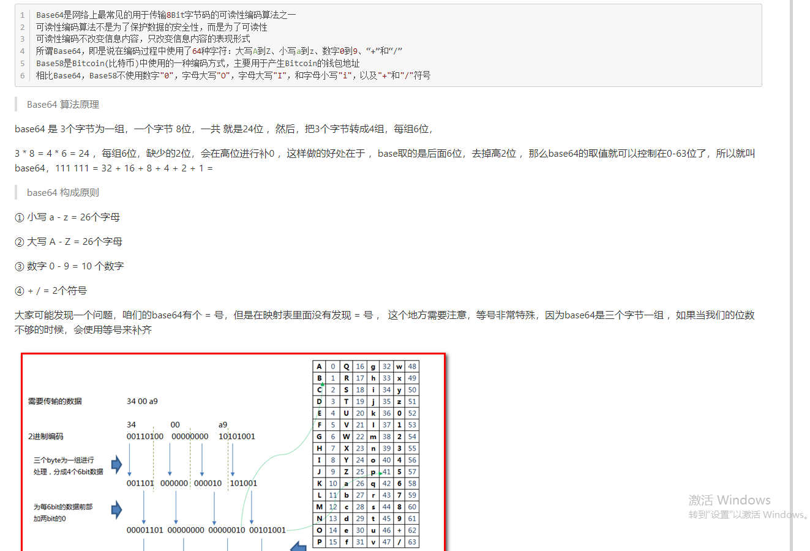

# 密码学

## 1.1密码学基本概念

密码学是网络安全、信息安全、区块链等产品的基础，常见的非对称加密、对称加密、散列函数等，都属于密码学范畴。

### 1 .1.1古典密码学

1 替换法

 就是用固定的信息将原文替换成无法直接阅读的密文信息 

1.2 移位法

移位法就是将原文中的所有字母都在字母表上向后（或向前）按照一个固定数目进行偏移后得出密文，典型的移位法应用有 “ 恺撒密码 ”。

1.3 古典密码破解方式

多表的替换法或移位法虽然难度高一些，但如果数据量足够大的话，也是可以破解的。以维尼吉亚密码算法为例，破解方法就是先找出密文中完全相同的字母串，猜测密钥长度，得到密钥长度后再把同组的密文放在一起，使用频率分析法破解。

### 1.1.2 近代密码学

恩尼格玛机使用的加密方式本质上还是移位和替代，只不过因为密码表种类极多，破解难度高，同时加密解密机器化，使用便捷，因而在二战时期得以使用。

### 1.1.3 现代密码学

1 散列函数

散列函数，也见杂凑函数、摘要函数或哈希函数，可将任意长度的消息经过运算，变成固定长度数值，常见的有`MD5`、`SHA-1`、`SHA256`，多应用在文件校验，数字签名中。

MD5 可以将任意长度的原文生成一个128位（16字节）的哈希值

SHA-1可以将任意长度的原文生成一个160位（20字节）的哈希值

2 对称密码

对称密码应用了相同的加密密钥和解密密钥。对称密码分为：序列密码(流密码)，分组密码(块密码)两种。流密码是对信息流中的每一个元素（一个字母或一个比特）作为基本的处理单元进行加密，块密码是先对信息流分块，再对每一块分别加密。

例如原文为1234567890，流加密即先对1进行加密，再对2进行加密，再对3进行加密……最后拼接成密文；块加密先分成不同的块，如1234成块，5678成块，90XX(XX为补位数字)成块，再分别对不同块进行加密，最后拼接成密文。前文提到的古典密码学加密方法，都属于流加密。

3 非对称加密

对称密码的密钥安全极其重要，加密者和解密者需要提前协商密钥，并各自确保密钥的安全性，一但密钥泄露，即使算法是安全的也无法保障原文信息的私密性。

在实际的使用中，远程的提前协商密钥不容易实现，即使协商好，在远程传输过程中也容易被他人获取，因此非对称密钥此时就凸显出了优势。

非对称密码有两支密钥，公钥（publickey）和私钥（privatekey），加密和解密运算使用的密钥不同。用公钥对原文进行加密后，需要由私钥进行解密；用私钥对原文进行加密后（此时一般称为签名），需要由公钥进行解密（此时一般称为验签）。公钥可以公开的，大家使用公钥对信息进行加密，再发送给私钥的持有者，私钥持有者使用私钥对信息进行解密，获得信息原文。因为私钥只有单一人持有，因此不用担心被他人解密获取信息原文。

### 1.1.4 如何设置密码才安全

- 密码不要太常见，不要使用类似于123456式的常用密码。
- 各应用软件密码建议不同，避免出现一个应用数据库被脱库，全部应用密码崩塌，
- 可在设置密码时增加注册时间、注册地点、应用特性等方法。例如tianjin123456，表示在天津注册的该应用。

## 1.2 ASCLL编码


### 1.2.1 代码

```java
cryptography\src\main\java\com\cryp\ascii\AsciiDemo.java
```

## 1.3 凯撒加密

### 1.3.1 外国加密


### 1.3.2 代码

```java
cryptography\src\main\java\com\cryp\kaiser\KaiserDemo.java
```

## 1.4 Byte和bit

中文在GBK编码下，占据2个字节

中文在UTF-8编码下，占据3个字节

## 1.5 常见加密方式


### 1.5.1 对称加密

### 

### 1.5.2 DES加解密代码

```java
cryptography\src\main\java\com\cryp\des\DesAesDemo.java
```

### 1.5.3 base64补等号测试



### 1.5.4 AES加解密代码

```java
cryptography\src\main\java\com\cryp\des\AesDemo.java
```

### 1.5.5 toString()与new String ()用法区别


### 1.5.6 加密模式


## 1.6 消息摘要


### 1.6.1 特点


### 1.6.2 代码

```java
cryptography\src\main\java\com\cryp\digest_消息摘要\DigestDemo1.java
```

### 1.6.3 总结


## 1.7 非对称加密


### 1.7.1 RSA和ECC介绍


### 1.7.2 代码

```java
cryptography\src\main\java\com\cryp\rsa_非对称加密\RSAdemo.java
```

